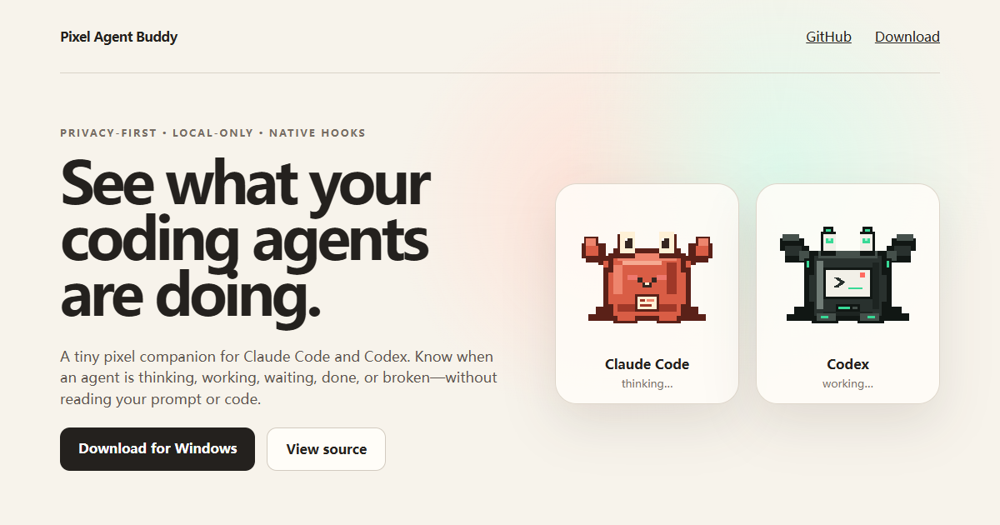
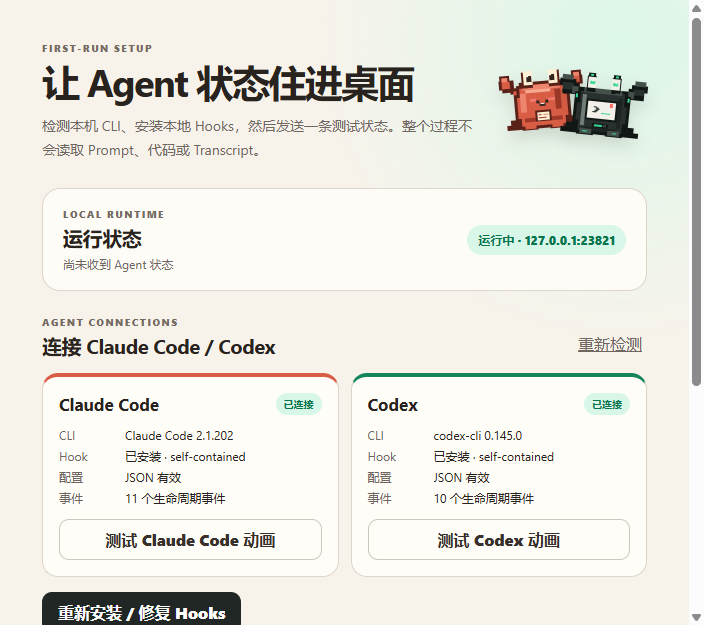

<div align="center">
  
  <h1>Pixel Agent Buddy</h1>
  <p><strong>面向 Claude Code 与 Codex 的隐私优先像素桌面伙伴。</strong></p>

  [](https://github.com/44-99/pixel-agent-buddy/actions/workflows/ci.yml)
  [](https://github.com/44-99/pixel-agent-buddy/releases)
  [](LICENSE)

  [English](README.md) · [官网](https://44-99.github.io/pixel-agent-buddy/) · [下载](https://github.com/44-99/pixel-agent-buddy/releases) · [隐私说明](PRIVACY.md)
</div>

Pixel Agent Buddy 将 Claude Code 与 Codex 的原生生命周期 hooks 转换为桌面上的轻量状态提示。你无需反复切回终端，就能知道 Agent 正在思考、工作、等待审批、完成、失败还是休息；应用不会读取 Prompt、代码、Transcript、助手回复或工具输入输出。

## 为什么做这个项目？

- **隐私就是产品本身**：Hook 进程只允许发送文档中明确列出的少量元数据。
- **只使用原生 Hooks**：不抓 Transcript，不轮询日志，不接外部 Gateway，也没有隐藏 fallback。
- **观察失败不影响 Agent**：应用不会接管 Allow/Deny，Claude Code/Codex 的原生流程始终有效。
- **刻意保持小而专注**：不做聊天、记忆、RPG、排行榜、Dashboard 或远程控制。
- **双 Agent 原创像素形象**：Claude Code 是暖色小螃蟹，Codex 是终端机械蟹。
- **安全共存**：安装器保留其他工具的 hooks，失败时回滚本次修改。

## 支持的状态

| 状态 | 含义 |
|---|---|
| 待机 | 等待新任务 |
| 思考 | 阅读上下文或制定计划 |
| 工作 | 执行工具或修改文件 |
| 审批 | 等待原生 CLI 权限确认 |
| 完成 | 任务已结束 |
| 失败 | 工具或当前轮次失败 |
| 睡眠 | 没有活跃的 Claude Code 或 Codex 会话 |

## 快速开始

### 直接下载

前往 [GitHub Releases](https://github.com/44-99/pixel-agent-buddy/releases) 下载 Windows 安装包或便携版。下载版自带 Hook 执行环境，不再要求单独安装 Node.js。首次启动引导会集中显示 CLI 版本、Hook 健康状态、执行模式和本地运行状态；安装或修复已检测的 Hooks 后，可以先发送一条测试状态再完成引导。以后仍可从宠物右键菜单或托盘重新打开诊断界面。

<div align="center">
  
</div>

### 从源码运行

要求：Windows 10/11；从源码开发时需要 Node.js 20+；另外需要 Claude Code 和/或支持生命周期 Hooks 的 Codex CLI。

```powershell
git clone https://github.com/44-99/pixel-agent-buddy.git
cd pixel-agent-buddy
npm install
npm run install:hooks
npm start
```

只安装一个 Agent adapter：

```powershell
npm run install:claude
npm run install:codex
```

检查本机安装状态：

```powershell
npm run doctor
```

只卸载本项目管理的 hooks：

```powershell
npm run uninstall:hooks
```

按住鼠标左键可拖动宠物。右键菜单只保留设置与诊断、Hooks 状态与修复、开机启动、隐藏和退出；日常动画由真实 Agent 事件驱动，诊断界面可以显式发送一次本地测试状态。

## 隐私契约

Hooks 只允许发送：

- Agent 类型；
- 会话、父会话和子 Agent 标识；
- 生命周期事件及归一化显示状态；
- 当前工作目录和项目目录名；
- 工具名称；
- 本地时间戳。

Hooks 不会发送 Prompt、代码、`tool_input`、`tool_response`、Transcript 内容、助手消息或权限决定。传输只发生在带随机 Token 验证的 `127.0.0.1`。完整说明见 [PRIVACY.md](PRIVACY.md)。

应用不会自动检查更新。只有用户主动点击“手动检查更新”时，才会访问公开的 GitHub Releases API。

## 工作原理

```text
Claude Code adapter ─┐
                     ├─> 元数据清洗 Hook
Codex adapter ───────┘          │
                                ├─> 带认证的本机 HTTP
                                ├─> 多会话状态仲裁
                                └─> Electron presentation → 像素伙伴
```

安装器会先验证所有目标配置，再开始任何写入。配置修改带备份和失败回滚，并保留所有无关 Hook 条目。

已验证的 CLI 版本、不同 Agent 的事件覆盖范围，以及 Codex Hook 信任步骤见 [Agent 兼容性说明](docs/compatibility.md)。

## 开发与验证

```powershell
npm test
npm run build
npm run generate:assets
npm run preview:assets
npm run preview:setup
```

两张透明 PNG 由项目内的固定像素形状确定性生成，不依赖图片 API，也不包含第三方网络素材。

## 项目边界

Pixel Agent Buddy 当前只专注 Claude Code 与 Codex 的环境状态提示。只有当用户确实需要、且目标 Agent 提供稳定生命周期 seam 时，才考虑增加新的 adapter。

提交新 Agent 或扩大产品范围前，请先阅读 [CONTRIBUTING.md](CONTRIBUTING.md)。

## License

[MIT](LICENSE) © 2026 [44-99](https://github.com/44-99)
